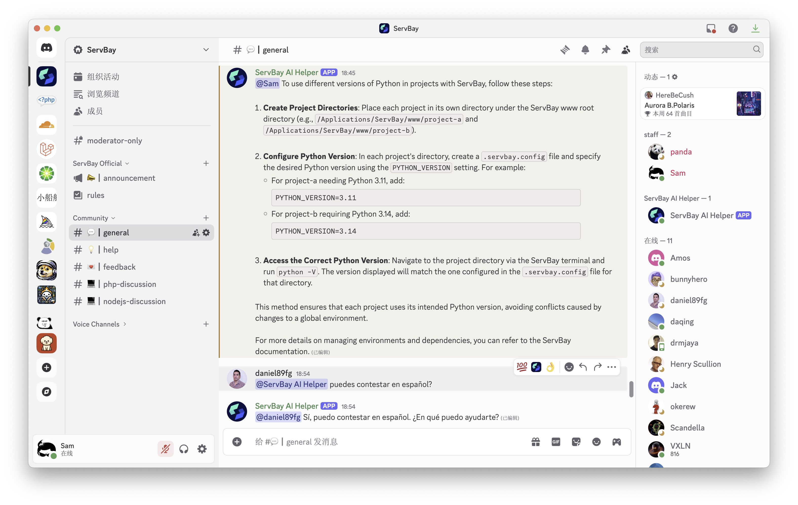
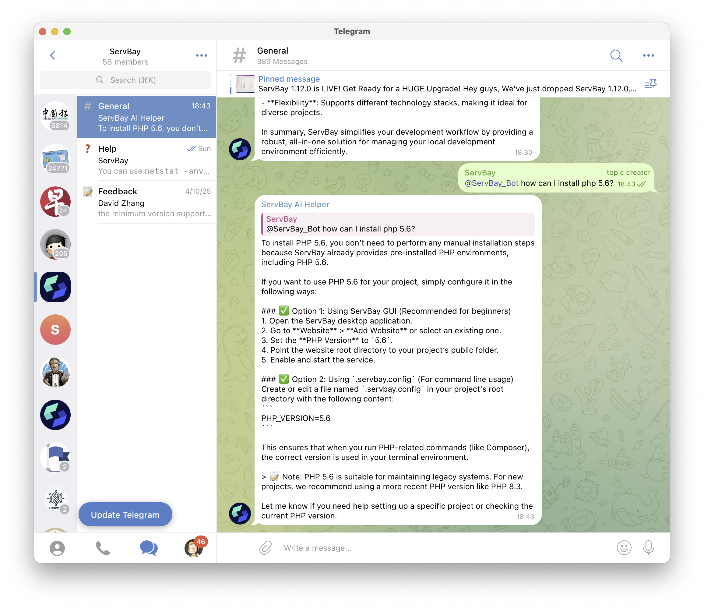

# ServBay-AI-Helper

A simple AI assistant bot based on Ali BaiLian, supporting Telegram and Discord.

一个基于阿里百炼的简单AI助手机器人，支持Telegram和Discord。

两分钟就能部署完毕，简单粗暴，不需要费劲巴拉的搞那么一大堆框架和依赖。一如 [ServBay](https://www.servbay.com) 所主打的理念：3 分钟配置好开发环境。

## Screenshots





## Getting started

1. Create an [Ali BaiLian](https://bailian.console.aliyun.com/) application, and get the `APP_ID` and `APP_KEY`.

2. Create a [Discord](https://discord.com/developers/applications) application, and get the `DISCORD_TOKEN`.

3. Create a [Telegram](https://t.me/botfather) bot, and get the `TELEGRAM_TOKEN`.

4. Install dependencies

```bash
python3 -m venv venv
source venv/bin/activate
pip install -r requirements.txt
```

5. set environment variables in `.env`

6. run the robot

```bash
python3 discord_bot.py
python3 telegram_bot.py
```

7. Enjoy!

## License

@2025 [ServBay, LLC](https://www.servbay.com). Free to use for personal and commercial purposes.